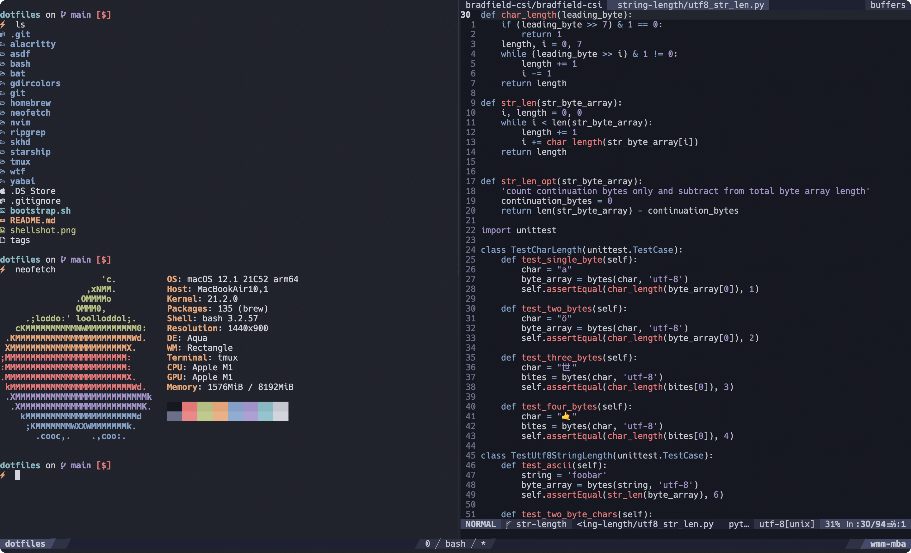

# dotfiles | dot-dot-dot

## some of my favorite tools and utilities:

- [Alacritty](https://github.com/alacritty/alacritty) : terminal
- [Neovim](https://github.com/neovim/neovim) : text editor
- [bat](https://github.com/sharkdp/bat) : cat clone with syntax highlighting and Git integration
- [exa](https://github.com/ogham/exa) : a modern replacement for ls
- [fd](https://github.com/sharkdp/fd) : simple, fast and user-friendly alternative to find
- [fzf](https://github.com/junegunn/fzf) : command-line fuzzy finder and file system navigation
- [htop](https://github.com/htop-dev/htop) : interactive process viewer
- [ripgrep](https://github.com/BurntSushi/ripgrep) : command-line search utility (faster than grep and ag)
- [tmux](https://github.com/tmux/tmux) : terminal multiplexer for project/session management and restore, because re-opening projects is 😭
- [zoxide](https://github.com/ajeetdsouza/zoxide) : a faster way to navigate the filesystem
- tree : Display directories as trees (with optional color/HTML output)

My other utilities and applications (primarily macOS) can be found in my [Brewfile](./Brewfile)
