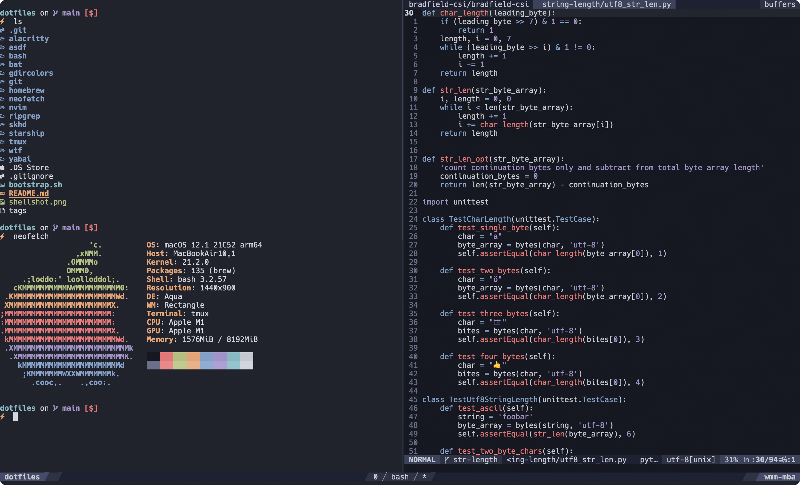

# dotfiles | dot-dot-dot



Personal macOS dotfiles managed with GNU Stow and Homebrew. Most configs live in self-contained package directories so you can link only the pieces you actively use.

## Setup

1. Clone the repo to `~/dotfiles`.
2. Optionally run [`bootstrap.sh`](./bootstrap.sh) to create an SSH key and install Homebrew.
3. Install packages from [`homebrew/Brewfile`](./homebrew/Brewfile):

   ```sh
   brew bundle --file="$HOME/dotfiles/homebrew/Brewfile"
   ```

4. Preview the default Stow allow-list:

   ```sh
   cd ~/dotfiles
   make stow-preview
   ```

5. Apply those links when the preview looks correct:

   ```sh
   make stow-apply
   ```

If you want tighter control than the default allow-list in [`Makefile`](./Makefile), use Stow directly:

```sh
cd ~/dotfiles
stow -nv zsh git tmux nvim ghostty starship ssh ripgrep gdircolors
stow -v zsh git tmux nvim ghostty starship ssh ripgrep gdircolors
```

Use `make stow-list` to inspect the current default package set.

## Package map

### Core packages

| Package | Target | Notes |
| --- | --- | --- |
| `zsh/` | `~/.zshrc`, `~/.zprofile`, `~/.zshenv`, helpers | Primary shell setup |
| `bash/` | `~/.bashrc`, `~/.bash_profile`, helpers | Secondary shell config |
| `git/` | `~/.gitconfig`, `~/.gitignore_global`, `~/.config/git/` | Git defaults and scripts |
| `ssh/` | `~/.ssh/config` | SSH host aliases and options |
| `tmux/` | `~/.tmux.conf`, `~/.tmux/` | Tmux config and plugins |
| `nvim/` | `~/.config/nvim/` | Neovim configuration |
| `ghostty/` | `~/.config/ghostty/config` | Primary terminal config |
| `starship/` | `~/.config/starship.toml` | Cross-shell prompt |
| `ripgrep/` | `~/.ripgreprc` | Shared ripgrep defaults |
| `gdircolors/` | `~/.dir_colors` | Shared directory color theme for shell tools |
| `asdf/` | `~/.asdfrc`, `~/.tool-versions` | Runtime version management |
| `bat/` | `~/.config/bat/` | `bat` theme/config |
| `homebrew/` | Brew bundle files | Package bootstrap via Brewfile |

### Optional or machine-specific packages

These packages are kept in the repo for selective use and are not part of the default `make stow-*` allow-list:

`alacritty/`, `cursor/`, `iterm2/`, `neofetch/`, `opencode/`, `wezterm/`, `wtf/`

## Tooling

The Brewfile installs the CLI tools and desktop apps this repo expects, including:

- shells and prompt: `bash`, `starship`, `asdf`, `direnv`, `coreutils`
- terminal/editor workflow: `tmux`, `neovim`, `ghostty`
- search/navigation: `ripgrep`, `fd`, `fzf`, `zoxide`, `bat`, `eza`
- git/dev utilities: `git`, `gh`, `git-delta`, `lazygit`, `pre-commit`

See [`homebrew/Brewfile`](./homebrew/Brewfile) for the full package list, casks, MAS apps, and VS Code extensions.
