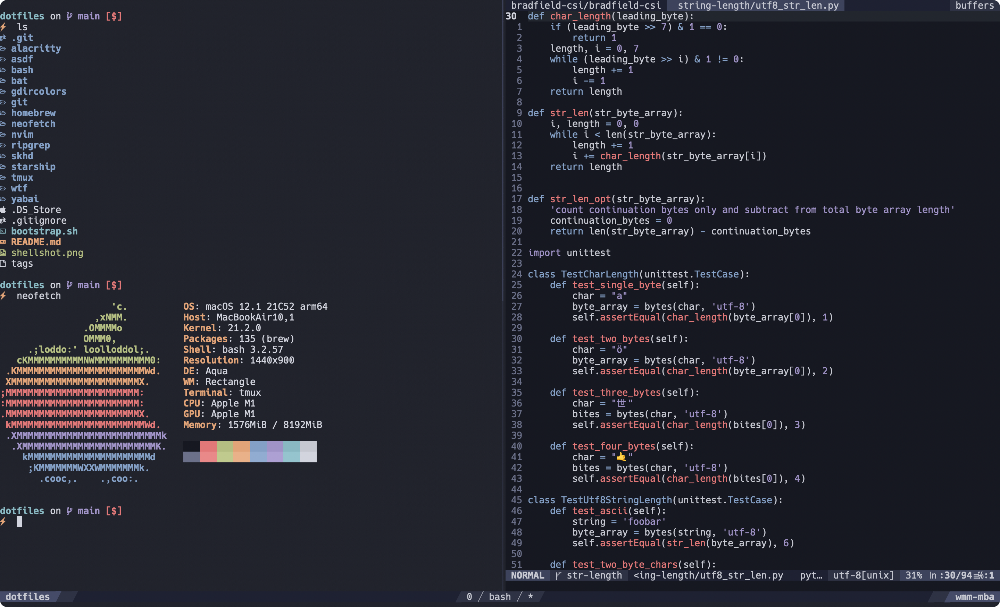

# dotfiles | dot-dot-dot



Personal macOS dotfiles managed with GNU Stow and Homebrew. Most configs live in self-contained package directories so you can link only the pieces you actively use.

## Setup

1. Clone the repo to `~/dotfiles`.
2. Optionally run [`bootstrap.sh`](./bootstrap.sh) to create an SSH key and install Homebrew.
3. Install packages from [`homebrew/Brewfile`](./homebrew/Brewfile):

   ```sh
   brew bundle --file="$HOME/dotfiles/homebrew/Brewfile"
   ```

4. Preview the default Stow allow-list:

   ```sh
   cd ~/dotfiles
   make stow-preview
   ```

5. Apply those links when the preview looks correct:

   ```sh
   make stow-apply
   ```

If you want tighter control than the default allow-list in [`Makefile`](./Makefile), use Stow directly:

```sh
cd ~/dotfiles
stow -nv zsh git tmux nvim ghostty starship ssh ripgrep gdircolors
stow --no-folding -nv ctx codex-config
stow -v zsh git tmux nvim ghostty starship ssh ripgrep gdircolors
stow --no-folding -v ctx codex-config
```

Use `make stow-list` to inspect the current default package set.

## Package map

### Core packages

| Package | Target | Notes |
| --- | --- | --- |
| `zsh/` | `~/.zshrc`, `~/.zprofile`, `~/.zshenv`, helpers | Primary shell setup |
| `bash/` | `~/.bashrc`, `~/.bash_profile`, helpers | Secondary shell config |
| `git/` | `~/.gitconfig`, `~/.gitignore_global`, `~/.config/git/` | Git defaults and scripts |
| `ssh/` | `~/.ssh/config` | SSH host aliases and options |
| `tmux/` | `~/.tmux.conf`, `~/.tmux/` | Tmux config and plugins |
| `nvim/` | `~/.config/nvim/` | Neovim configuration |
| `ghostty/` | `~/.config/ghostty/config` | Primary terminal config |
| `starship/` | `~/.config/starship.toml` | Cross-shell prompt |
| `ripgrep/` | `~/.ripgreprc` | Shared ripgrep defaults |
| `gdircolors/` | `~/.dir_colors` | Shared directory color theme for shell tools |
| `asdf/` | `~/.asdfrc`, `~/.tool-versions` | Runtime version management |
| `bat/` | `~/.config/bat/` | `bat` theme/config |
| `ctx/` | `~/.ctx/config.toml` | Durable ctx preferences; private index/runtime state remains local |
| `codex-config/` | `~/.codex/AGENTS.md`, `~/.codex/policies/`, `~/.codex/parallel-work.config.toml`, `~/.codex/skills/orchestrating-parallel-worktrees/` | Global and progressive Codex policy plus the opt-in parallel-work profile and local orchestration skill; private runtime state remains local |
| `homebrew/` | Brew bundle files | Package bootstrap via Brewfile |

The `ctx` package is state-adjacent: `~/.ctx` must remain a real local directory
because it contains private, mutable search indexes and runtime files. The
Makefile therefore stows `ctx` separately with `--no-folding`, linking only
`config.toml`. The installer-managed `~/.local/bin/ctx` binary is not part of
the package. Bundled ctx agent skills also remain installer-managed; the
OpenCode copy is ignored by Git because its global skills directory links into
this repository.

The `codex-config` package follows the same state-adjacent pattern. `~/.codex`
must remain a real local directory because it contains private, mutable runtime
state. Stowing `codex-config` with `--no-folding` links tracked policy, profile,
and skill files without replacing or folding the real runtime directory. The
parallel profile remains inactive unless Codex is launched with
`-p parallel-work`.

Coordinators prepare and launch an existing linked worktree through the tracked
helper rather than reconstructing `ENGRAM_PROJECT`, the profile, or `-C`
arguments manually:

```sh
session_helper="${CODEX_HOME:-$HOME/.codex}/skills/orchestrating-parallel-worktrees/scripts/worktree-session"
task_root="/path/to/repository/.worktrees/task-slug"

"$session_helper" guard
CODEX_THREAD_ID="coordinator-thread" "$session_helper" prepare \
  --worktree "$task_root" \
  --task-id "TASK-123" \
  --task-slug "task-slug" \
  --plan "docs/plans/task-plan.md" \
  --base-ref "main" \
  --base-sha "0123456789abcdef0123456789abcdef01234567" \
  --shared-project "repository" \
  --task-project "repository-task-123" \
  --target-branch "main" \
  --integration-owner "integration-coordinator"
"$session_helper" launch --worktree "$task_root"
```

From a repository's primary checkout, `guard` reports `COORDINATOR_ONLY`.
That state permits coordination and the narrow creation of an approved plan
and descriptor in a new linked worktree; it does not permit implementation in
another checkout through `workdir`, `git -C`, or absolute paths. A linked
worktree without a safe descriptor fails closed. Start its implementation in a
fresh helper-launched Codex session rather than converting the coordinator into
its writer.

Launch and resume set the descriptor task project both in the worker process
and in Codex's per-launch Engram MCP server environment. The latter boundary is
required because an environment variable on the outer Codex process is not, by
itself, inherited by Codex-managed MCP children. Workers still confirm the
effective project with `mem_current_project` before writing. The worker startup
sequence is `guard`, `claim`, `mem_current_project`, and `verify`; repeat it
after compaction or resume. The helper also rejects a task project already used
by another linked-worktree descriptor in the same repository.

### Recovering existing sessions that bypassed the helper

If a concurrent session was started from the primary checkout, from an
unprepared linked worktree, or without the `parallel-work` profile, do not keep
using that thread as an implementation writer:

1. Stop repository mutations and record the exact worktree root, branch, HEAD,
   `git status`, current goal, verification state, and remaining work. Leave
   uncommitted files in place.
2. Exit the old Codex thread. Do not resume its session ID into the repaired
   workflow: profiles, startup instructions, working root, and MCP environment
   are process-start boundaries.
3. From a coordinator, prepare a descriptor for that existing linked worktree
   with a unique task project, then launch a fresh worker with
   `worktree-session launch --worktree <root>`.
4. In the fresh worker, require `guard`, `claim`, `mem_current_project`, and
   `verify` to pass before the next write. Reconcile the handoff against live
   Git rather than trusting recovery memory.

Do not delete the shared canonical Engram history or blindly merge task
projects. Treat already-interleaved entries as historical recovery material;
promote only reviewed durable discoveries. Upstream
[Engram issue #587](https://github.com/Gentleman-Programming/engram/issues/587)
describes the preferred future model—one logical project with per-worktree
stores, fork points, and lossless three-way merge—but that design must be
implemented and qualified before replacing this containment boundary.

Disposable canaries may additionally isolate Engram's database in an existing
directory beneath the task worktree:

```sh
mkdir -p "$task_root/.canary-data/live"
ENGRAM_DATA_DIR="$task_root/.canary-data/live" \
  "$session_helper" launch --worktree "$task_root"
```

The helper rejects relative paths, the worktree root itself, and paths or
symlinks that resolve outside the task worktree. Normal task launches omit
`ENGRAM_DATA_DIR` and use the configured Engram data store with a distinct
task project.

Stow activation and provider-backed canary execution remain separate approval
gates; installing these tracked files does not prove live multi-worker behavior.

### Optional or machine-specific packages

These packages are kept in the repo for selective use and are not part of the default `make stow-*` allow-list:

`alacritty/`, `cursor/`, `iterm2/`, `neofetch/`, `opencode/`, `wezterm/`, `wtf/`

## Tooling

The Brewfile installs the CLI tools and desktop apps this repo expects, including:

- shells and prompt: `bash`, `starship`, `asdf`, `direnv`, `coreutils`
- terminal/editor workflow: `tmux`, `neovim`, `ghostty`
- search/navigation: `ripgrep`, `fd`, `fzf`, `zoxide`, `bat`, `eza`
- git/dev utilities: `git`, `gh`, `git-delta`, `lazygit`, `pre-commit`

See [`homebrew/Brewfile`](./homebrew/Brewfile) for the full package list, casks, MAS apps, and VS Code extensions.
